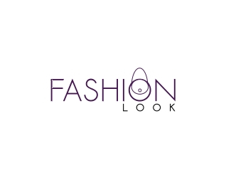

<div align="center">
  

 <div style="margin-top: 40px;">

[](https://reactjs.org/)
[](https://vitejs.dev/)
[](https://developers.google.com/web/tools/lighthouse)
[](https://mui.com/)
</div>
</div>


# FashionLook

FashionLook est une boutique en ligne dédiée à la mode et aux vêtements. Ce projet vise à transformer l'expérience utilisateur en modernisant l'application existante vers React, offrant ainsi une solution plus stable et performante.


## Technologies

- [React](https://reactjs.org/)
- [Material-UI (MUI)](https://mui.com/)
- [Vite](https://vitejs.dev/)

## Installation du Projet
Clonez le dépôt:

git clone https://github.com/Soukainalarabi/FashionLook.git

### Installation des Dépendances Front-End
Installez toutes les dépendances pour le front-end:

```bash
npm install ou yarn add
```

### Lancement du Front-End
Lancez le front-end:
```bash
npm run dev ou yarn start
```
Le front-end sera accessible à l'URL: [http://localhost:5173/accueil](http://localhost:5173/accueil).


## Déploiement


## Tests de Performance


